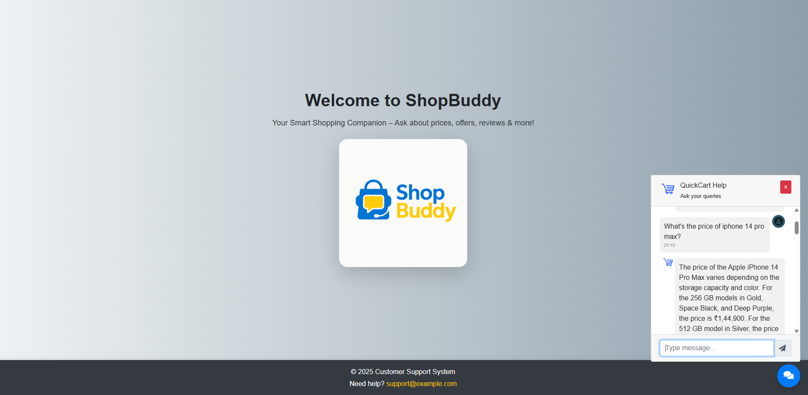
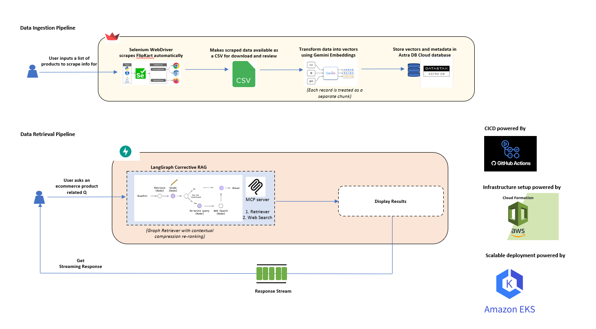

# ShopBuddy - E-Commerce Product Assistant 🛒🤖

An intelligent e-commerce assistant that combines real-time web scraping, vector databases, and agentic AI workflows to provide comprehensive product information, comparisons, and recommendations.



## 🎯 Problem Statement

### Challenge
Customers struggle to find comprehensive, up-to-date product information when shopping online. Information is scattered across multiple sources, with a lot of noise from Sponsored Ads, making informed purchasing decisions difficult and time-consuming.

### Pain Points
- **Scattered Data**: Product information spread across different webpages
- **No Intelligent Comparison**: Lack of AI-powered product comparison capabilities
- **Manual Research**: Time-consuming manual search across multiple pages
- **Information Overload**: Difficulty in processing large amounts of product data

### Solution
ShopBuddy is an AI-powered assistant that:
- **Scrapes real-time data** from e-commerce platforms
- **Processes customer queries** intelligently using agentic workflow powered with retriever and hybrid search based MCP tools
- **Provides comprehensive answers** about products, prices, reviews, and comparisons
- **Offers conversational interface** for natural product discovery

## 🏗️ Architecture Overview



### Core Components

#### 1. Data Ingestion Pipeline
##### 1.a. Real-time Web Scraping using Selenium
- **Undetected ChromeDriver** for bot detection avoidance
- **Dynamic content handling** with automated scrolling and interaction
- **Structured data extraction** from Flipkart product pages
- **Anti-bot mechanisms** including random delays and user-agent rotation
- **Robust error handling** for network issues and page changes

##### 1.b. Data Storage in AstraDB with Google Vector Embeddings
- **AstraDB Vector Database** for scalable similarity search
- **Google text-embedding-004** for semantic understanding
- **Metadata indexing** for efficient filtering (price, rating, category)
- **Hybrid search capabilities** combining semantic and keyword matching
- **Real-time data ingestion** pipeline for fresh product information

#### 2. Data Retrieval Pipeline
##### 2.a. Agentic Corrective RAG Workflow with MCP Tools
- **LangGraph-based workflow** with multiple specialized nodes:
  - **Assistant Node**: Query routing and tool selection
  - **Tool Node**: MCP-based product search execution
  - **Grader Node**: Document relevance evaluation
  - **Rewrite Node**: Query improvement and refinement
  - **Generate Node**: Final response synthesis
- **Model Context Protocol (MCP)** for seamless tool integration
- **Self-correcting mechanism** that improves queries automatically and uses Web search if retriever doesn't have the necessary context
- **Multi-LLM support** (Groq LLaMA, Google Gemini, OpenAI GPT-4)

#### 3. Deployment
#### 3.a. GitHub Actions CICD
#### 3.b. AWS Infra
#### 3.c. UIUX
- **Async FastAPI backend** for high-performance request handling
- **Interactive chat interface** with floating chatbot design
- **Real-time response streaming** for better user experience
- **RESTful API endpoints** for programmatic access
- **CORS-enabled** for cross-origin requests

## 🚀 Getting Started

### Prerequisites
- Python 3.10+
- Chrome browser (for Selenium)
- API keys for:
  - AstraDB (Vector Database)
  - Google AI (Embeddings & Gemini)
  - Groq (LLaMA models)
  - OpenAI (GPT models)

### Installation

1. **Clone the repository**
```bash
git clone <repository-url>
cd ecomm-prod-assistant
```

2. **Create virtual environment**
```bash
python -m venv ecommprod_env
# Windows
ecommprod_env\Scripts\activate
# Linux/Mac
source ecommprod_env/bin/activate
```

3. **Install dependencies**
```bash
pip install -r requirements.txt
pip install -e .
```

4. **Environment Configuration**
Create `.env` file in the root directory:
```env
# AstraDB Configuration
ASTRA_DB_API_ENDPOINT=your_astradb_endpoint
ASTRA_DB_APPLICATION_TOKEN=your_astradb_token

# AI Model API Keys
GOOGLE_API_KEY=your_google_api_key
GROQ_API_KEY=your_groq_api_key
OPENAI_API_KEY=your_openai_api_key
```

### Running the Application

1. **Start MCP Server** (Terminal 1)
```bash
python prod_assistant/mcp_servers/product_search_server.py
```

2. **Start Main Application** (Terminal 2)
```bash
python prod_assistant/router/main.py
# Or use the CLI command
ecomm-assistant
```

3. **Access the Application**
- Web Interface: http://localhost:8001
- API Documentation: http://localhost:8001/docs
- MCP Server: http://localhost:8000/mcp/

### Data Setup (Optional)

**Scrape sample data and ingest it into AstraDB:**
```bash
streamlit run scrapper_ui.py
```

## 🛠️ Technology Stack

### Backend & API
- **FastAPI**: High-performance async web framework
- **Uvicorn**: ASGI server for production deployment
- **Pydantic**: Data validation and settings management
- **Python-multipart**: Form data handling

### AI & Machine Learning
- **LangChain**: LLM application framework
- **LangGraph**: Workflow orchestration for agentic AI
- **LangChain-MCP**: Model Context Protocol integration
- **RAGAS**: RAG evaluation framework
- **Google AI**: Text embeddings and Gemini models
- **Groq**: High-speed LLaMA inference
- **OpenAI**: GPT-4 for advanced reasoning

### Data & Storage
- **AstraDB**: Serverless vector database
- **Pandas**: Data manipulation and analysis
- **CSV**: Structured data storage
- **BeautifulSoup**: HTML parsing

### Web Scraping
- **Selenium**: Browser automation
- **Undetected ChromeDriver**: Anti-detection web scraping
- **Chrome WebDriver**: Browser control

### Frontend
- **HTML5/CSS3**: Modern web standards
- **JavaScript/jQuery**: Interactive functionality
- **Bootstrap 4**: Responsive UI framework
- **Font Awesome**: Icon library

### DevOps & Deployment
- **Docker**: Containerization
- **Kubernetes**: Container orchestration
- **AWS EKS**: Managed Kubernetes service
- **GitHub Actions**: CI/CD pipeline
- **ECR**: Container registry

## 📊 Usage Examples

### Basic Product Query
```
User: "What is the price and rating of iPhone 14 Pro Max?"
ShopBuddy: "The iPhone 14 Pro Max is priced at ₹1,29,900 with a rating of 4.5/5 based on 1,234 reviews. Customers particularly praise its camera quality and battery life..."
```

### Product Comparison
```
User: "Compare Samsung Galaxy S23 vs iPhone 14 camera quality"
ShopBuddy: "Based on customer reviews: iPhone 14 excels in video recording and low-light photography, while Galaxy S23 offers better zoom capabilities and AI-enhanced features..."
```

### Feature-Specific Query
```
User: "What do customers say about OnePlus 11 battery life?"
ShopBuddy: "OnePlus 11 users consistently praise the battery performance, with most reviews mentioning 6-8 hours of screen time and fast 100W charging..."
```

## 🔧 Configuration

### Model Configuration (`prod_assistant/config/config.yaml`)
```yaml
embedding_model:
  provider: "google"
  model_name: "models/text-embedding-004"

llm:
  groq:
    model_name: "llama-3.3-70b-versatile"
    temperature: 0
  google:
    model_name: "gemini-2.0-flash"
    temperature: 0
```

### Retriever Settings
```yaml
retriever:
  top_k: 8
  similarity_threshold: 0.7
```

## 🚢 Deployment

### Docker Deployment
```bash
# Build image
docker build -t shopbuddy .

# Run container
docker run -p 8001:8001 --env-file .env shopbuddy
```

## 📄 License

This project is licensed under the MIT License - see the [LICENSE](LICENSE.md) file for details.

## 🙏 Acknowledgments

Krish Naik Academy (https://www.krishnaik.in/)
Sunny Savita (https://github.com/sunnysavita10)

---

**Built with ❤️ for smarter e-commerce experiences**